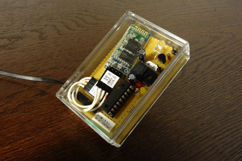
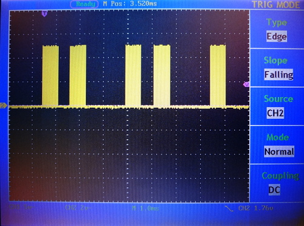
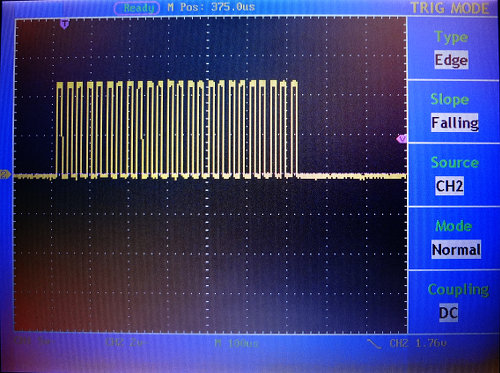
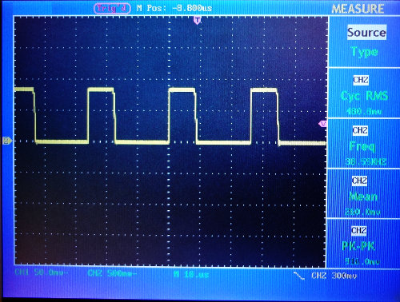

##  Bluetooth Serial接続で制御する赤外線リモコン出力回路 (PIC 16F1827)<!-- omit in toc -->

---
[Home](https://oasis3855.github.io/webpage/) > [Software](https://oasis3855.github.io/webpage/software/index.html) > [Software Download](https://oasis3855.github.io/webpage/software/software-download.html) > [pic-ir_sender](../README.md) > ***ir_sender_16f1827*** (this page)

 
 

Last Updated : Aug. 2014

- [ソフトウエアのダウンロード](#ソフトウエアのダウンロード)
- [概要](#概要)
- [デバイスの制作](#デバイスの制作)
  - [回路図](#回路図)
  - [トランジスタ周りの抵抗値計算](#トランジスタ周りの抵抗値計算)
  - [完成写真](#完成写真)
- [搬送波の調整](#搬送波の調整)
  - [PICマイコンのPWM設定パラメータ](#picマイコンのpwm設定パラメータ)
- [Bluetooth シリアル通信で受信するデータ構造](#bluetooth-シリアル通信で受信するデータ構造)
- [バージョンアップ情報](#バージョンアップ情報)
- [ライセンス](#ライセンス)

 
 

## ソフトウエアのダウンロード

-    [このGitHubリポジトリを参照する](../ir_sender_16f1827/) 

-    [GoogleDriveを参照する](https://drive.google.com/drive/folders/0B7BSijZJ2TAHV0VGQ3QwdmlBWUU)

 
 

## 概要

Androidスマートフォンのアプリ [ir_sender_android](../ir_sender_android/) から Bluetooth を介してコントロールすることができる、赤外線リモコン信号出力デバイスです。

 
 

## デバイスの制作
### 回路図

 [BSch3V用回路図ファイルをダウンロードする](./pics/android-ir-sender-16f1837-circuit.CE3)

回路図には記載していないが、三端子レギュレータ周りにコンデンサが必要。データシートよりCin > 0.1uF、Cout > 47uF 以上のものが必要。 

|名称|型番・仕様|個数|参考価格|
|---|---|---|---|
|PICマイコン|PIC16F1827|1個|208円|
|三端子レギュレータ|μPC29M33A|1個||
|電解コンデンサ|10uF|1個||
|電解コンデンサ|47uF|1個||
|NPNトランジスタ|2SC1815|1個|21円|
|赤外線LED|940nm, If=100mA, Vf=1.2〜1.4V|1個|20円|
|炭素皮膜抵抗|2.2kΩ|1個|5円|
|炭素皮膜抵抗|1kΩ|2個|5円|
|炭素皮膜抵抗|33Ω|1個|5円|
|LED|赤(通電表示用)|1個|20円|

別途、モジュールを利用したものは次の通り

|名称|型番・仕様|個数|参考価格|
|---|---|---|---|
|Bluetoothシリアル|HC-06 (VCC=3.6〜6V, RX,TX=3.3V)|1個|5 USドル|

### トランジスタ周りの抵抗値計算 

**コレクタ抵抗（LED側）**

- LED電流値 IF = 100mA 
- LED順方向電圧 VF = 1.2〜1.4V → 1.3V 
- 駆動電圧 Vcc = 5.0V 

オームの法則より Rc = (5 - 1.3) / 0.100 = 37 Ω → 33 Ω 

**ベース抵抗（スイッチング抵抗）**

- ベース電圧 V = 3.3V 
- 半導体損失 0.6V 
- コレクタ電流 Ic = 100mA 
- Hfe = 200 → 安全率3として Hfe = 67 

オームの法則より Rb = (3.3 - 0.6) / (0.100/67 ) = 1809 Ω → 1.8 or 2.2 kΩ（E12系列） 

### 完成写真

 
 

## 搬送波の調整 

ルネサスのWebページに掲載されている「NECフォーマットの赤外線リモコン送受信ICの取扱説明書」をダウンロードし、そこに掲載された搬送波のタイミングチャートより、標準的な信号パターンは次のようなものと仮定する。 

※ ここでは、[uPD780078の使用法説明書](https://www.renesas.com/jp/ja/document/apn/632521)を参考にした

||Hi|Lo|
|---|---|---|
|リーダー（スタートビット）|16T = 9000us|8T = 4500us|
|1|1T = 560us|3T = 1690us|
|0|1T = 560us|1T = 560us|
|トレーラー（ストップビット）|1T = 560us|108ミリ秒の残り|

信号のHi部分は、38kHzの搬送波で構成され、デューティ比は1/3とされている。PICのPWM出力機能を利用して、設定パラメータはオシロスコープを用いて微調整し、38kHz,1/3デューティ比となるようにする。なお、SONY方式など一部のリモコンは搬送波周波数が40kHzなどと少し違うため、Android機からPICマイコンに送るCSVファイルにPWMコントロール用のパラメータを含められるようにしている。

 信号フォーマット。横軸1メモリが1ミリ秒

0，1，0，1 … のNECフォーマットの信号。0データのHiが642マイクロ秒、Loが470マイクロ秒というYAMAHAの解析値に近いタイミングにカスタマイズしている。 

 Hiの部分を拡大してみる。横軸が100マイクロ秒

Hiの部分（642マイクロ秒）が、38kHzのキャリア信号で表現されている。今回は、PICで簡単に実現するため、PWMの方形波を用いている。

 キャリア信号部分をさらに拡大してみる。横軸が10マイクロ秒

デューティ比をだいたい1/3にした

 
 

### PICマイコンのPWM設定パラメータ

家電協フォーマット、NECフォーマット（38kHz）

|PR2, CCPR1L|周波数 (kHz)|Hi : Lo (μsec)|
|---|---|---|
|26, 8|37.1kHz|8.8 : 18.0|

|PR2, CCPR1L|周波数 (kHz)|Hi : Lo (μsec)|
|---|---|---|
|25, 6|38.55kHz|6.8 : 19.2|
|25, 7|38.55kHz|8.0 : 18.0|
|25, 8|38.55kHz|8.8 : 17.2|
|25, 9|38.55kHz|10.0 : 16.0|
|25, 10|38.55kHz|10.8 : 15.2|
|25, 11|38.55kHz|12.0 : 14.0|
|25, 12|38.55kHz|12.8 : 13.2|

SONYフォーマット（40kHz）

|PR2, CCPR1L|周波数 (kHz)|Hi : Lo (μsec)|
|---|---|---|
|24, 8|40.1kHz|8.8 : 16.0|
|24, 7|40.1kHz|8.0 : 17.2|

 
 

## Bluetooth シリアル通信で受信するデータ構造

main.c関数内でchar rs232c_buffer[]配列に格納されるBluetooth受信データは、次の通り。なお、12 Bytesより大きな場合、つまり 少なくともdata byte 4まで存在する場合のみ赤外線信号の送信処理が行われる。これは、NECフォーマットでデータ長さが4Bytesであることから規定している。

|byte|0|1|2|3|4|
|---|---|---|---|---|---|
|| start_hi | start_lo | signal_hi | signal_1_lo | signal_0_lo |

|5|6|7|
|---|---|---|
| mode | pr2 | ccpr1l |

|8|9|10|11|...|
|---|---|---|---|---|
| data byte 1 | data byte 2 | data byte 3 | data byte 4 | ... |

@param データ
|   | 説明 |
|---|---|
| mode | 下位8ビットが 1=NEC/家電協コード, 2=PWMテスト信号連続, 4=テスト信号, 5=RAW。上位8ビットの1ビット目はNEC/家電協コードを2回連続送信する時 |
| pr2 | PWM周波数 : PICマイコンのPWM制御 パラメータ |
| ccpr1l | デューティ比 : PICマイコンのPWM制御 パラメータ |

@timing データ
|   | 説明 |
|---|---|
| start_hi | スタートビットのHi時間（μsec） |
| start_lo | スタートビットのLo時間（μsec） |
| signal_hi | 通常信号1または0のHi時間（μsec） |
| signal_1_lo | 通常信号1のLo時間（μsec） |
| signal_0_lo | 通常信号0のLo時間（μsec） |

 
 

## バージョンアップ情報

-  Version 1.0 (2014/08/16) 

 
 

## ライセンス

このソフトウエアは [GNU General Public License v3ライセンスで公開する](https://gpl.mhatta.org/gpl.ja.html) フリーソフトウエア
