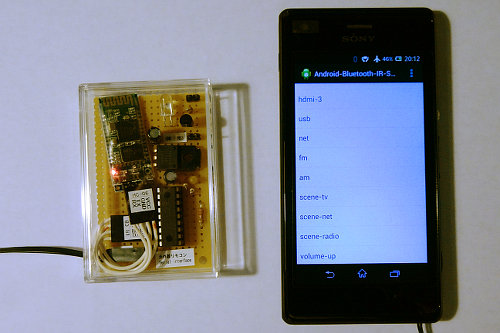
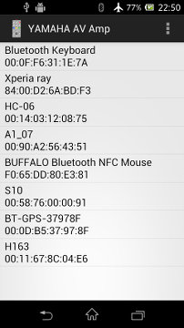
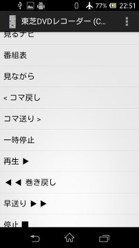

##  Bluetooth Serial接続で制御する赤外線リモコン出力コントローラ (Android)<!-- omit in toc -->

---
[Home](https://oasis3855.github.io/webpage/) > [Software](https://oasis3855.github.io/webpage/software/index.html) > [Software Download](https://oasis3855.github.io/webpage/software/software-download.html) > [pic-ir_sender](../README.md) > ***ir_sender_android*** (this page)

 
 

Last Updated : Aug. 2014

- [ソフトウエアのダウンロード](#ソフトウエアのダウンロード)
- [概要](#概要)
- [動作状況](#動作状況)
- [CSVファイルの書式](#csvファイルの書式)
- [CSVファイルの例](#csvファイルの例)
  - [NECフォーマットの場合の例](#necフォーマットの場合の例)
  - [家電協フォーマットの場合の例](#家電協フォーマットの場合の例)
- [バージョンアップ情報](#バージョンアップ情報)
- [ライセンス](#ライセンス)

 
 

## ソフトウエアのダウンロード

-    [このGitHubリポジトリを参照する](../ir_sender_android/) 

-    [GoogleDriveを参照する](https://drive.google.com/drive/folders/0B7BSijZJ2TAHV0VGQ3QwdmlBWUU)

 
 

## 概要

Bluetooth を介してコントロールすることができる、赤外線リモコン信号出力デバイス [ir_sender_android](../ir_sender_16f1827/) を用いて、簡単にリモコン信号を送信できるAndroidアプリです。

このアプリを利用するためには、別途リモコンの赤外線信号を解析しCSVファイルに保存したデータが必要です。

 
 

## 動作状況

 ir_sender_androidデバイスと、このアプリが動作中のスマホ

 Bluetoothデバイスの選択画面（ペアリング済みのみを一覧表示） 

 コード送信画面（CSVファイルの送信データをリスト表示）

 
 

## CSVファイルの書式

CSVファイルは、次のような構造となっている。

    @param = mode,pr2,ccpr1l
    @timing = start_hi,start_lo,signal_hi,signal_1_lo,signal_0_lo
    @title = タイトル行文字列
    ボタン1 = 01,23,45,67,
    ボタン2 = 0A,0B,0C,0D,
    ボタン3 = 01,02,03,04,

@で始まる行は省略可能で、デフォルト値は次の通り。

    @param = 1,25,8
    @timing = 9000,4500,560,1690,560
    @title = [CSVファイル名]

@param と @timing の値の説明

|項目|説明|
|---|---|
|mode|下位8ビットが &nbsp;&nbsp;&nbsp;1=NEC/家電協コード &nbsp;&nbsp;&nbsp;2=PWMテスト信号連続 &nbsp;&nbsp;&nbsp;4=テスト信号 &nbsp;&nbsp;&nbsp;5=RAW 上位8ビットの1ビット目はNEC/家電協コードを2回連続送信する時|
|pr2, ccpr1l|PICマイコンのPWM制御|
|start_hi|スタートビットのHi時間（μsec）|
|start_lo|スタートビットのLo時間（μsec）|
|signal_hi|通常信号1または0のHi時間（μsec）|
|signal_1_lo|通常信号1のLo時間（μsec）|
|signal_0_lo|通常信号0のLo時間（μsec）|

 
 

## CSVファイルの例

実際に家電製品のコントロールに成功したサンプルCSVファイルを、[sample-csv](../sample-csv)に格納してる。代表例を次に示す。

### NECフォーマットの場合の例

***日立製テレビW32L-H9000***

    @title = 日立 液晶テレビ
    電源 = 0A,F5,E8,17,
    画面表示 = 0A,F5,08,F7,
    音声多重 = 0A,F5,10,EF,
    入力切替 = 0A,F5,90,6F,
    地デジ 1 = 6A,95,8E,71,
    地デジ 2 = 6A,95,4E,B1,
    地デジ 3 = 6A,95,CE,31,
    〜 以下省略 〜

***東芝製DVDレコーダー***

コードを2回送信するために @param:modeの上位8ビットに1をセットしている

    @param = 17,25,8
    @timing = 9100,4400,600,1600,500
    @title = 東芝DVDレコーダー
    電源 = A2,3D,48,B7,
    トレイ 開閉 = A2,3D,88,77,
    放送切替 = A2,3D,84,7B,
    スタートメニュー = A2,3D,62,9D,
    入力切替 = A2,3D,F0,0F,
    ドライブ切替 = A2,3D,45,BA,
    録画切替 TS/RE = A2,3D,C6,39,
    〜 以下省略 〜

### 家電協フォーマットの場合の例

***Panasonic製シーリングライト***

コードを2回送信するために @param:modeの上位8ビットに1をセットしている

    @param = 17,25,8
    @timing = 3500,1600,540,1200,360
    @title = Panasonic室内照明
    ch1-点灯・普段 = 34,4A,90,B4,24,
    ch1-消灯 = 34,4A,90,F4,64,
    ch1-白い色 > = 34,4A,9C,09,95,
    ch1-暖かい色 > = 34,4A,9C,89,15,
    〜 以下省略 〜

 
 

## バージョンアップ情報

-  Version 0.1 (2014/08/16) 
-  Version 0.2 (2014/08/20) 

 
 

## ライセンス

このソフトウエアは [GNU General Public License v3ライセンスで公開する](https://gpl.mhatta.org/gpl.ja.html) フリーソフトウエア
